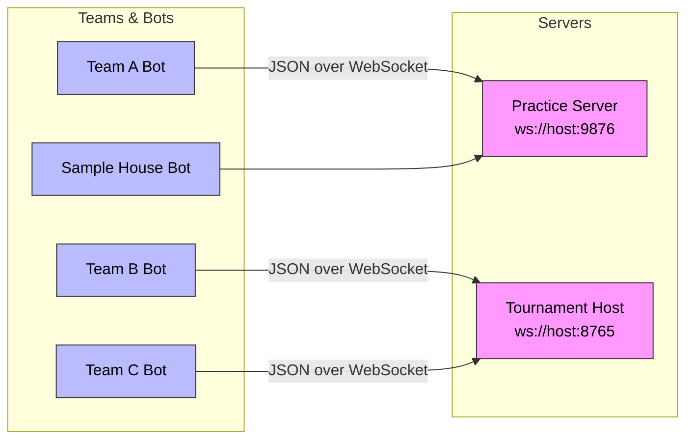

```mermaid
flowchart LR
    subgraph Servers
        A[Practice Server<br/>ws://host:9876]:::server
        B[Tournament Host<br/>ws://host:8765]:::server
    end

    subgraph Teams & Bots
        direction TB
        T1[Team A Bot]:::bot -->|JSON over WebSocket| A
        T2[Team B Bot]:::bot -->|JSON over WebSocket| B
        T3[Team C Bot]:::bot -->|JSON over WebSocket| B
        T4[Sample House Bot]:::bot --> A
    end

    classDef server fill:#f9f,stroke:#333,stroke-width:1px,color:#000;
    classDef bot fill:#bbf,stroke:#333,stroke-width:1px,color:#000;
```